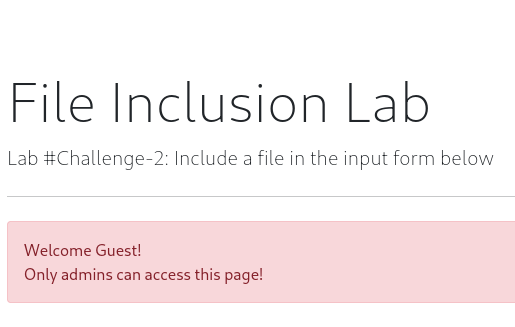

# 🧠 TryHackMe Room: File Inclusion (Challenge Task Only)

**Room URL:** [https://tryhackme.com/room/fileinc](https://tryhackme.com/room/fileinc)  
**Author:** Schenkee  
**Profile:** [https://tryhackme.com/p/schenkee](https://tryhackme.com/p/schenkee)

---

## 🧩 Challenge Task Overview

**Objective:**  
This guide will cover the steps required to gain the flags to comeplete the Challege task of the room. We will cover 2 different methods to gian RCE access to /playground.php for question 4. Please read through the initial tasks to gain an understanding of Local File Inclusion (LFI), Remote File Inclusion (RFI), and directory traversal Vulnerabilites.

---

## 🧰 Tools I Used
- Kali Linux
- Metasploit
- Curl
- Python3 http server
- Netcat
- PHP Reverse Shell By Pentestmonkey which can be found here: [https://github.com/pentestmonkey/php-reverse-shell/blob/master/php-reverse-shell.php](https://github.com/pentestmonkey/php-reverse-shell/blob/master/php-reverse-shell.php)

---

## 🛠️ TASK 1: Capture Flag1 at /etc/flag1
Navigate to the first task at **http://MACHINE_IP/challenges/chall1.php** Once the page loads we are greeted with a important message to aid us in capturing the flag.  
The page reads "The Input form is broken! You need to send **'POST'** request with **'file'** parameter! This message gives us a great starting point as we know we need to send a POST request. This can be done in a couple of different manners such as BurpSuite or Curl.

In this instance I will use Curl to generate the POST request and recive the flag. Open up your terminal either on your VM or in the AttackBox using CTRL+ALT+T and input the below command 

```curl http://MACHINE_IP/challenges/chall1.php -X POST -d "file=../../../../etc/flag1" ```  
-X is used with curl to change the request method from the default of GET to something else such as POST in this case  
-d is used to set the data to send with the POST request in this case file=../../../../etc/flag1  
  
You should end up with something like the below  
  
  
This will then return a raw response from the web server whhich will contain our flag as below.


---

## 🛠️ TASK 2: Capture Flag2 at /etc/flag2  
Now lets move onto the second challange at **http://MACHINE_IP/challenges/chall2.php** This time once the page loads we are greeted with a message asking us to refresh the page.  
Lets refresh as requested and then we are given some more important information as to the likley path for capture the flag. The page reads as below  
  
  
Lets inspect the page to see if we can work out whats going on here and how we can change ourselves to be an **admin** on investigtion of the cookie in the **Network** tab we can see that the cookie has a paramater of **THM=Guest** which we might be able to edit.  
  

Lets see if we can edit this cookie parameter to make oursevles an admin. Navigate to the **Storage** tab to modify the cookie. Lets adjust the cookie value from Guest to **admin** 


Once we have adjusted the cookie refresh the page and if succesfull we should revice a new message as below.  

